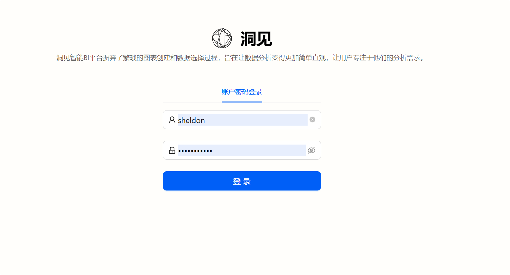
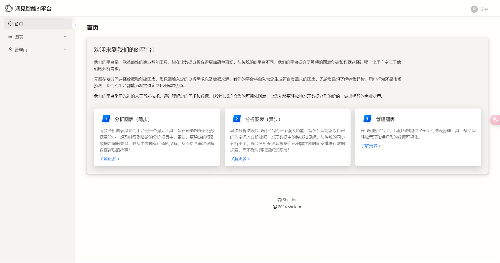

<!-- PROJECT LOGO -->

<div align="center">
    
    <h3 align="center">洞见智能BI平台</h3>
    <p align="center">
        基于 Spring Boot + MQ + AIGC（+ React）的智能数据分析平台。
        <br />
        区别于传统 BI 平台，用户只需输入数据及分析需求，即可自动生成可视化图表及分析结论，提高数据分析效率。
    </p>
</div>
<!-- TABLE OF CONTENTS -->

<details>
  <summary>Table of Contents</summary>
  <ol>
    <li>
      <a href="#关于项目">关于项目</a>
      <ul>
        <li><a href="#项目架构图">项目架构图</a></li>
        <li><a href="#技术栈">技术栈</a></li>
        <li><a href="#业务流程">业务流程</a></li>
      </ul>
    </li>
    <li>
      <a href="#用法">用法</a>
      <ul>
        <li><a href="#演示视频">演示视频</a></li>
        <li><a href="#项目截图">项目截图</a></li>
      </ul>
    </li>
    <li><a href="#快速开始">快速开始</a>
      <ul>
        <li><a href="#先决条件">先决条件</a></li>
        <li><a href="#安装">安装</a></li>
      </ul>
      </li>
    <li><a href="#联系方式">联系方式</a></li>
  </ol>
</details>


## 关于项目

### 项目总览

<div align="center">
    
</div>
<div>
    <p>
        该项目共有三个模块：
    <ul>
        <li>前端模块（React）：负责接受用户请求，展示用户分析图表结论数据</li>
        <li>后端管理模块（Spring Boot）：负责系统的后端管理，用户登录，图表管理，权限校验</li>
        <li>图表分析模块（Spring Boot）：通过消息队列，接受图表分析任务，请求AI服务，并处理分析结果</li>
    </ul>
    </p>
    <p align="center">
        <a href="https://github.com/sheldon-3601e/BI-frontend">前端模块</a>
        ·
        <a href="https://github.com/sheldon-3601e/BI-backend">后端管理模块</a>
        ·
        <a href="https://github.com/sheldon-3601e/BI-service">图表分析模块</a>
    </p>
</div>

### 技术栈

#### 前端

- React 18
- Ant Design Pro 5.x 脚手架
- Umi 4前端框架
- Ant Design 组件库
- Echarts 可视化库
- OpenAPI 前端代码生成
- WebSocket 消息通知

#### 后端

- Spring Boot
- MySQL 数据库
- Mybatis-Plus 及 mybatis X 自动生成
- Redis + Redisson 限流
- RabbitMQ 消息队列
- 星火大模型SDK（AI服务）
- Easy Excel处理工具
- Swagger + Knife4j 接口文档
- Hutool、Apache Common Utils 等工具库

### 业务流程

<div align="center">
    
</div>

用户分析图表的业务流程分析

1. 用户在前端网页提交分析要求和原始数据
2. 后端管理服务器接受请求，并将图表的基本信息和压缩后的数据存储在MySQL数据库中
3. 后端管理服务器将要分析的图表Id ,发送到 RabbitMQ 的交换机 `Bi_waiting_exchange`
4. 交换机 `Bi_waiting_exchange ` 将任务分发给消息队列中，并由对应的智能分析服务器接受
5. 智能分析服务器通过监听队列 ，进行图表分析
   1. 从MySQL数据库中查询要分析的图表信息，拼接用户请求
   2. 通过星火大模型SDK请求AI服务
   3. 请求成功
      1. 获取返回值，处理返回值，提取所需信息
      2. 将生成的信息保存到数据库
      3. 通过`BI_succeed_queue` 通知后端管理服务器
      4. 后端管理服务器接受分析成功的消息，通过WebSocket通知前端用户
   4. 请求失败
      1. 通过死信交换机`BI_failed_exchange` 通知后端管理服务器
      2. 后端管理服务器接受分析失败的消息，将数据库中图表的状态改为失败。通过WebSocket通知前端用户

<div align="center">
    
</div>

## 用法

### 演示视频
[演示视频](https://github.com/sheldon-3601e/BI-backend/assets/120535868/78219988-df88-4645-9487-9ef763915e3e
)


### 网站截图







## 快速开始

这是一个示例，说明如何在本地设置项目的说明。若要启动并运行本地副本，请按照以下简单示例步骤操作。

### 先决条件

列出使用该软件所需的内容

- npm@16.20.2
- MySQL@8.1.0
- Redis@3.2.1
- RabbitMQ@3.12.12

### 安装

下面是一个示例，说明如何安装和设置应用。

1. 克隆项目到本地

   ```sh
   git clone https://github.com/your_username_/Project-Name.git
   ```

2. 安装依赖s

   ```sh
   npm install
   ```

3. 在图表分析模块中`application.yml`中，填入星火大模型的参数

   ```yml
   appid: xxx
   apiKey: xxx
   apiSecret: xxx
   ```

4. 启动 Redis 和 RabbitMQ 服务

5. 分别启动各个模块

<p align="right">(<a href="#readme-top">back to top</a>)</p>


<!-- CONTACT -->

## 联系方式

Your Name - Sheldon - email@Sheldon_kkk@126.com

Personal homepage: [https://github.com/sheldon-3601e](https://github.com/sheldon-3601e)

<p align="right">(<a href="#readme-top">back to top</a>)</p>

